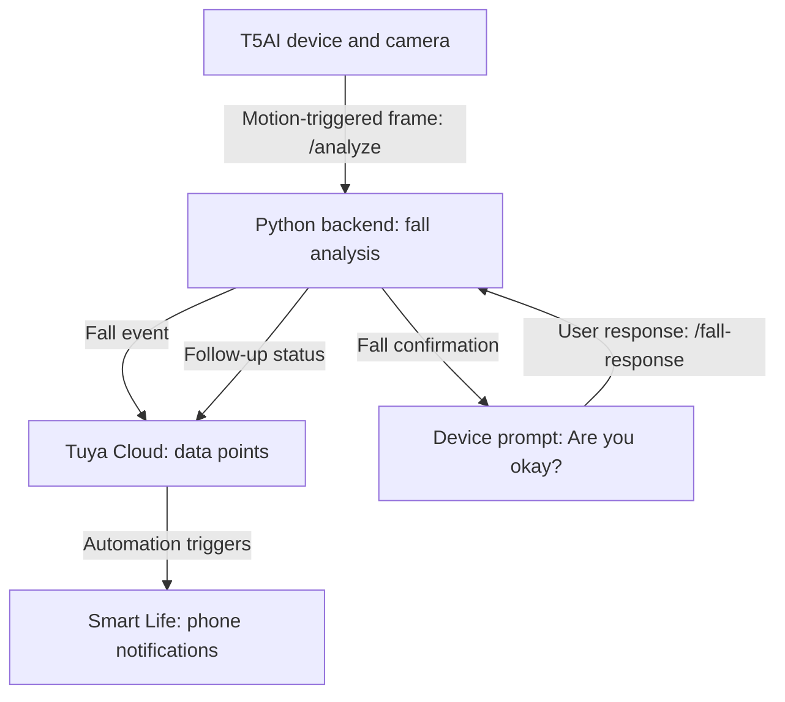

# IoT Fall Alert System — Tuya Cloud and Smart Life Integration

Cloud-to-app integration for a team-developed fall-detection prototype, connecting device status events to notifications in the Smart Life mobile app.

## Overview

The overall system is designed to detect a possible fall, notify a phone through Tuya Cloud, and ask the person whether they are okay. A follow-up notification communicates whether the person is okay or needs help.

This repository documents **Janane Sivakumar's contribution: the Tuya Cloud-to-Smart Life app integration**. Camera firmware, fall analysis, device display and response handling, and enclosure development were handled by other team members.

## My Contribution

My responsibility was the cloud-to-app portion of the system:

- Tuya IoT cloud project configuration and management of integration credentials.
- Configuration of the `fall_alert`, `user_ok`, and `needs_help` data points.
- Smart Life automations connecting those events to mobile notifications.
- Push-notification testing for the cloud-to-app workflow.

## System Architecture

The diagram shows the intended system workflow and where the cloud-to-app integration fits.

The original architecture names OpenCV or MoveNet as possible fall-analysis approaches and lists local or hosted backend options. The final detection implementation and deployment environment are not specified in this documentation.

## Cloud Events and Notification Behavior

| Data point | Event meaning | Intended app notification |
| --- | --- | --- |
| `fall_alert` | A fall has been detected by the backend. | Initial fall alert. |
| `user_ok` | The person confirms that they are okay. | Follow-up indicating that the person is okay. |
| `needs_help` | The person confirms that they need assistance. | Follow-up indicating that assistance is needed. |

These are logical data-point names. Numeric IDs, data types, trigger values, and exact notification text depend on the project's configuration.

## Integration Configuration

The integration connects the following components:

1. **Tuya cloud project:** Holds the cloud configuration and the credentials used by the backend integration.
2. **Device data points:** Represent the initial fall event and the two follow-up response states.
3. **Backend event mapping:** Updates the appropriate data point when a fall or user-response event occurs.
4. **Smart Life automations:** Associate each configured event condition with a mobile notification.
5. **Mobile app:** Receives the initial alert and the subsequent status notification.

To reproduce the integration, document the project's actual data-point IDs, types, trigger conditions, device/account linking process, required API permissions, and automation actions. Account-specific credentials must be supplied privately.

## Demonstration and Verification

The following scenarios can demonstrate the cloud-to-app behavior. This table describes expected behavior; it does not report measured test results.

| Scenario | Expected outcome |
| --- | --- |
| Trigger `fall_alert`. | A fall notification appears on the phone. |
| Trigger `user_ok` after a fall alert. | A follow-up notification indicates that the person is okay. |
| Trigger `needs_help` after a fall alert. | A follow-up notification indicates that assistance is needed. |
| Repeat the event sequence. | The notifications can be triggered again. |

Useful demonstration material includes:

- A screenshot of the three data-point definitions.
- Screenshots of the Smart Life automation conditions and actions.
- Screenshots of the initial alert and both follow-up notifications.
- A short video showing an event being triggered and its notification arriving on the phone.

For each recorded test, note the trigger, expected notification, observed notification, and pass/fail outcome. Distinguish tests using simulated cloud events from tests performed with the complete hardware and backend.

## Documentation Status

This README is based on the team architecture and the assigned cloud-to-app responsibilities. Configuration exports, screenshots, demo footage, exact data-point settings, and measured test results have not yet been added here.

The source architecture's work-split notes conflict with its main diagram about the Yes/No response mapping. This README follows the main diagram: answering Yes to “Are you okay?” corresponds to `user_ok`; answering No corresponds to `needs_help`. Confirm this mapping against the implemented system.

## Skills Demonstrated

- IoT cloud configuration.
- Device event and status mapping.
- Mobile app automation.
- Cloud-to-app notification integration.
- Integration testing and technical documentation.

## Credential Handling

Use redacted screenshots and placeholder values when sharing configuration. Keep cloud access secrets, tokens, personal account information, and private camera images out of the repository.
